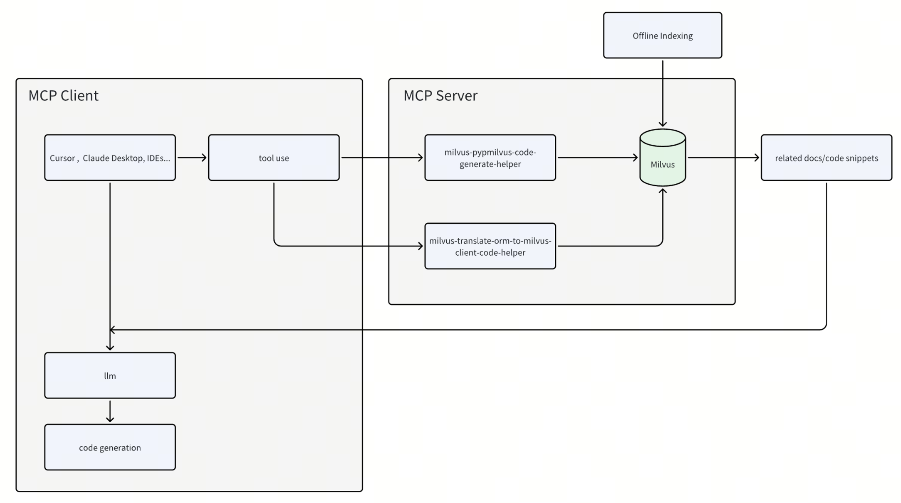

# mcp-pymilvus-code-generate-helper
> A Model Context Protocol server that retrieves relevant code snippets or documents to help generating pymilvus code.



## Prerequisites

Before using this MCP server, ensure you have:

- Python 3.10 or higher
- A running [Milvus](https://milvus.io/) instance (local or remote)
- [uv](https://github.com/astral-sh/uv) installed (recommended for running the server)

## Usage

The recommended way to use this MCP server is to run it directly with `uv` without installation. This is how both Claude Desktop and Cursor are configured to use it in the examples below. The server now support both sse and stdio:

### SSE
#### Running the Server
```shell
 uv run src/mcp_pymilvus_code_generate_helper/sse_server.py
```
#### Usage with Cursor
1. Go to `Cursor` > `Preferences` > `Cursor Settings` > `MCP`
2. Click on the `+ Add New MCP Server` button
3. Fill out the form:
   - **Name**: `pymilvus-code-generate-helper` (or any name you prefer)
   - **Type**: Select `sse`
   - **Server URL**: `http://10.100.30.11:8080/sse` (replace with your server's IP address)
4. Click `Save`
#### Usage with Claude Desktop
> ⚠️ Claude desktop is currently limited in its ability to connect to remote MCP servers

### STDIO
#### Running the Server
```shell
 uv run src/mcp_pymilvus_code_generate_helper/stdio_server.py
```
#### Usage with Cursor
1. Go to `Cursor` > `Preferences` > `Cursor Settings` > `MCP`
2. Click on the `+ Add New MCP Server` button
3. Fill out the form:
   - **Name**: `pymilvus-code-generate-helper` (or any name you prefer)
   - **Type**: Select `stdio`
   - **Command**: `/PATH/TO/uv --directory /path/to/mcp-pymilvus-code-generator run src/mcp_pymilvus_code_generate_helper/stdio_server.py`
4. Click `Save`
#### Usage with Claude Desktop
1. Install Claude Desktop from https://claude.ai/download
2. Open your Claude Desktop configuration:
   - macOS: `~/Library/Application Support/Claude/claude_desktop_config.json`
3. Add the following configuration:
```json
{
  "mcpServers": {
    "milvus": {
      "command": "/PATH/TO/uv",
      "args": [
        "--directory",
        "/path/to/mcp-server-milvus/src/mcp_server_milvus",
        "run",
        "src/mcp_pymilvus_code_generate_helper/stdio_server.py"
      ]
    }
  }
}
```
4. Restart Claude Desktop
> ⚠️ Note: Remember to set the OPENAI_API_KEY environment variable

## Available Tools

The server provides the following tools:

- `milvus-pypmilvus-code-generate-helper`: Find related pymilvus code/documents to help generating code from user input in natural language
  - Parameters:
    - `query`: User query for generating code

- `milvus-translate-orm-to-milvus-client-code-helper`: Find related orm and pymilvus client code/documents to help translating orm code to milvus client from user input in natural language
  - Parameters:
    - `query`: User query for translating orm code to milvus client code


## Contribution
Contributions are welcome! If you have ideas for improving the retrieve result, please submit a pull request or open an issue.

## License
This project is licensed under the MIT License.